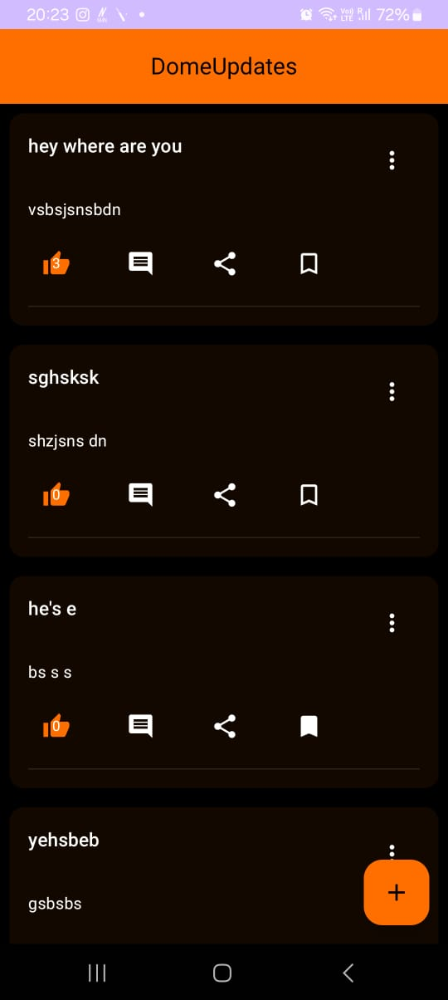
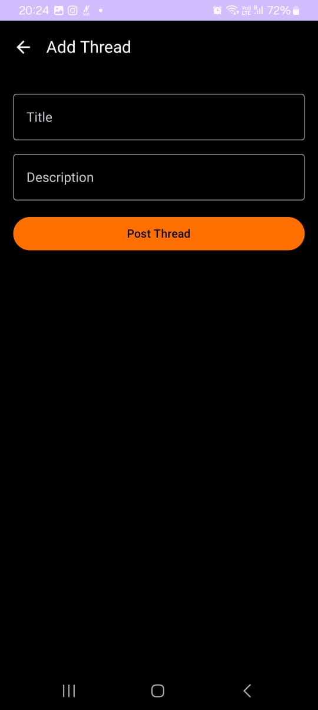
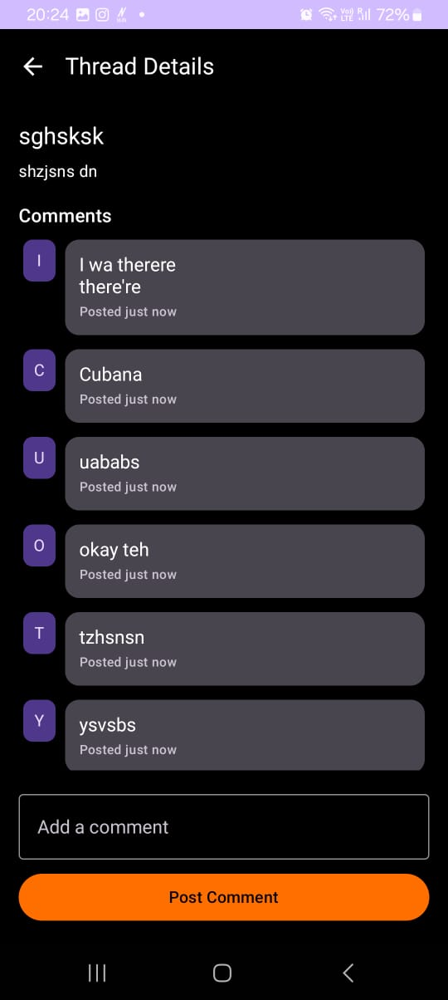

# Dome Updates 🧵

A simple Android app built with **Jetpack Compose**, **Room**, and **MVVM** architecture. Dome Updates allows users to create, view, and interact with discussion threads — perfect for community-driven conversations or idea sharing.

---

## ✨ Features

- 📜 View list of discussion threads
- ➕ Add new threads with a title and description
- ✏️ Edit the threads as per as your requirement
- 💬 Add comments to any thread
- ❤️ Like a thread to show support
- 👁️ Automatically increments views when a thread is opened

---

## 🛠️ Tech Stack

- **Jetpack Compose** — Modern UI toolkit
- **Room Database** — Local persistence
- **MVVM Architecture** — Clean separation of concerns
- **LiveData** — For reactive UI updates
- **Kotlin Coroutines** — Background threading

---

## 🏗️ Project Structure

```
com.example.domeupdates
├── data
│   ├── db              # Room database + DAO
│   └── model           # Entity models: ThreadEntity, CommentEntity
├── repository          # Repository layer for DB operations
├── ui
│   ├── components      # UI elements like ThreadCard
│   └── screens         # Composable screens: List, Add, Detail
├── viewmodel           # ThreadViewModel (business logic)
└── MainActivity.kt     # Entry point & screen navigation
```

---

## 🚀 Getting Started

### Prerequisites
- Android Studio Flamingo or newer
- Kotlin 1.8+
- Gradle 8+
- Min SDK 21+

### Clone the Repo

```bash
git clone https://github.com/yourusername/dome-updates.git
cd dome-updates
```

### Run the App

1. Open in Android Studio
2. Sync Gradle
3. Run on emulator or physical device

---

## 📸 Screenshots

| Thread List | Add Thread | Thread Details |
|-------------|-------------|----------------|
|  |  |  |

---

## 📦 Future Improvements

- 🔍 Search and filter threads
- 🗃️ Pagination or infinite scroll
- 🔔 Push notifications on new comments
- 🌐 Remote sync via Firebase/Retrofit

---

## 🙌 Contribution

Pull requests are welcome! Please fork the repository and submit a PR for review.

---

## 📝 License

This project is licensed under the MIT License.

---

## 👨‍💻 Author

**Kumar Shashwat**  
[LinkedIn](https://www.linkedin.com/in/kumar-shashwat-b6a149274/) • [GitHub](https://github.com/Shaswat098)